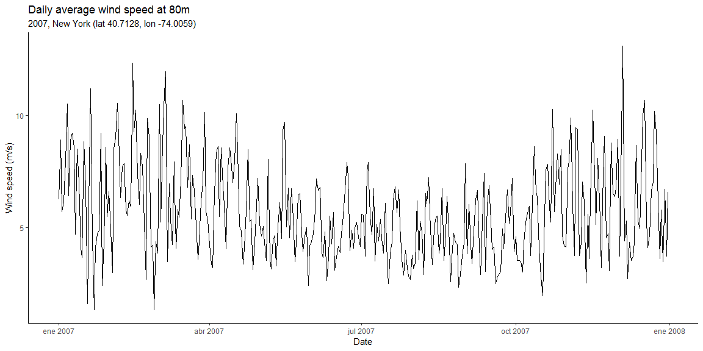

<!-- README.md is generated from README.Rmd. Please edit that file -->
wtkapi
======

[](https://www.tidyverse.org/lifecycle/#experimental)

The goal of wtkapi is to get data from the [Gridded Atmospheric Wind Integration National Dataset Toolkit](https://www.nrel.gov/grid/wind-toolkit.html) in tidy format to leverage technical analysis of atmospheric data.

It is required to sign up for an API key on the [NREL Developer Network](https://developer.nrel.gov/). Please also consider the API call rate limits.

Installation
------------

You can install the development version of wtkapi from GitHub with:

``` r
# install.packages("devtools")
devtools::install_github("floresfdev/wtkapi")
```

At the moment this package is heavy on dependencies (see `Imports` on [DESCRIPTION](DESCRIPTION.md)), so in order to have more control over your environment, avoid install/upgrade dependencies with:

``` r
devtools::install_github("floresfdev/wtkapi", dependencies = FALSE, upgrade_dependencies = FALSE)
```

Example
-------

This is a basic example which shows you how to get data:

``` r
library(dplyr)
library(lubridate)
library(ggplot2)
library(glue)
library(wtkapi)

# API parameters
endpoint <- "https://developer.nrel.gov/api/hsds/"
host <- "/nrel/wtk-us.h5"
api_key <- readr::read_lines(here::here("api_key.txt"))

# Get the info of the available datasets
datasets <- get_datasets(endpoint, host, api_key)

# Info to select the year 2007, with 1-hour resolution data
datetime_info <-
    compute_datetime_info(datetime_from = "2007-01-01 00:00:00",
                          datetime_to = "2007-12-31 23:00:00",
                          datetime_step = 1)
                          
# Info to select the location: New York
latitude <- 40.7128
longitude <- -74.0059

# Info to select the datasets as columnar data
datasets$title
```

    ##  [1] "DIF"                          "DNI"                         
    ##  [3] "GHI"                          "coordinates"                 
    ##  [5] "datetime"                     "inversemoninobukhovlength_2m"
    ##  [7] "precipitationrate_0m"         "pressure_0m"                 
    ##  [9] "pressure_100m"                "pressure_200m"               
    ## [11] "relativehumidity_2m"          "status"                      
    ## [13] "temperature_100m"             "temperature_10m"             
    ## [15] "temperature_120m"             "temperature_140m"            
    ## [17] "temperature_160m"             "temperature_200m"            
    ## [19] "temperature_2m"               "temperature_40m"             
    ## [21] "temperature_60m"              "temperature_80m"             
    ## [23] "winddirection_100m"           "winddirection_10m"           
    ## [25] "winddirection_120m"           "winddirection_140m"          
    ## [27] "winddirection_160m"           "winddirection_200m"          
    ## [29] "winddirection_40m"            "winddirection_60m"           
    ## [31] "winddirection_80m"            "windspeed_100m"              
    ## [33] "windspeed_10m"                "windspeed_120m"              
    ## [35] "windspeed_140m"               "windspeed_160m"              
    ## [37] "windspeed_200m"               "windspeed_40m"               
    ## [39] "windspeed_60m"                "windspeed_80m"

``` r
dataset_titles <- c("temperature_10m", "windspeed_10m", "winddirection_10m",
                        "temperature_40m", "windspeed_40m", "winddirection_40m",
                        "temperature_80m", "windspeed_80m", "winddirection_80m")

# Get data from the API
wind_temp_2007 <- 
    get_dataset(datasets,
                api_key,
                dataset_titles,
                datetime_info,
                latitude,
                longitude)

# Number of rows: 8760 = 365 days * 24 hours
nrow(wind_temp_2007)
```

    ## [1] 8760

``` r
# Check first and last records
head(wind_temp_2007)
```

    ## # A tibble: 6 x 12
    ##   datetime            latitude longitude temperature_10m windspeed_10m
    ##   <dttm>                 <dbl>     <dbl>           <dbl>         <dbl>
    ## 1 2007-01-01 00:00:00     40.7     -74.0            278.          1.42
    ## 2 2007-01-01 01:00:00     40.7     -74.0            278.          1.19
    ## 3 2007-01-01 02:00:00     40.7     -74.0            278.          1.22
    ## 4 2007-01-01 03:00:00     40.7     -74.0            279.          1.04
    ## 5 2007-01-01 04:00:00     40.7     -74.0            279.          1.05
    ## 6 2007-01-01 05:00:00     40.7     -74.0            280.          1.91
    ## # ... with 7 more variables: winddirection_10m <dbl>,
    ## #   temperature_40m <dbl>, windspeed_40m <dbl>, winddirection_40m <dbl>,
    ## #   temperature_80m <dbl>, windspeed_80m <dbl>, winddirection_80m <dbl>

``` r
tail(wind_temp_2007)
```

    ## # A tibble: 6 x 12
    ##   datetime            latitude longitude temperature_10m windspeed_10m
    ##   <dttm>                 <dbl>     <dbl>           <dbl>         <dbl>
    ## 1 2007-12-31 18:00:00     40.7     -74.0            278.          6.65
    ## 2 2007-12-31 19:00:00     40.7     -74.0            278.          6.67
    ## 3 2007-12-31 20:00:00     40.7     -74.0            278.          6.62
    ## 4 2007-12-31 21:00:00     40.7     -74.0            278.          5.60
    ## 5 2007-12-31 22:00:00     40.7     -74.0            277.          4.10
    ## 6 2007-12-31 23:00:00     40.7     -74.0            277.          4.00
    ## # ... with 7 more variables: winddirection_10m <dbl>,
    ## #   temperature_40m <dbl>, windspeed_40m <dbl>, winddirection_40m <dbl>,
    ## #   temperature_80m <dbl>, windspeed_80m <dbl>, winddirection_80m <dbl>

``` r
# Plots

plot_subtitle <- glue("2007, New York (lat {latitude}, lon {longitude})")

## Daily min/max temperature at 10m
wind_temp_2007 %>%
    ## Convert temperature from Kelvin to Celsius
    mutate(temperature_10m = temperature_10m - 273.15) %>%
    ## Get the min and max temperature for each day
    mutate(date = as_date(datetime)) %>%
    group_by(date) %>%
    summarize(min_temperature_10m = min(temperature_10m),
              max_temperature_10m = max(temperature_10m)) %>%
    ## Plot timeseries
    ggplot() +
    geom_line(aes(x = date,
                  y = min_temperature_10m),
              color = "blue") +
    geom_line(aes(x = date,
                  y = max_temperature_10m),
              color = "red") +
    labs(x = "Date",
         y = "Temperature (°C)",
         title = "Daily min/max temperature at 10m",
         subtitle = plot_subtitle,
         caption = "Blue = daily min  -  Red = daily max") +
    theme_classic()
```


``` r
## Daily average wind speed at 80m
wind_temp_2007 %>%
    ## Get the average of windspeed for each day
    mutate(date = as_date(datetime)) %>%
    group_by(date) %>%
    summarize(avg_windspeed_80m = mean(windspeed_80m)) %>%
    ## Plot timeseries
    ggplot() +
    geom_line(aes(x = date,
                  y = avg_windspeed_80m)) +
    labs(x = "Date",
         y = "Wind speed (m/s)",
         title = "Daily average wind speed at 80m",
         subtitle = plot_subtitle) +
    theme_classic()
```



``` r
## Histogram of hourly wind speed at 80m
ggplot(wind_temp_2007) +
    geom_histogram(aes(x = windspeed_80m),
                   fill = "white",
                   color = "black") +
    labs(x = "Wind speed (m/s)",
         y = "Count",
         title = "Histogram of hourly wind speed at 80m",
         subtitle = plot_subtitle) +
    theme_classic()
```


Code of conduct
---------------

Please note that this project is released with a [Contributor Code of Conduct](CODE_OF_CONDUCT.md). By participating in this project you agree to abide by its terms.

License
-------

Copyright (c) 2018, Fernando Flores

License TBD.
